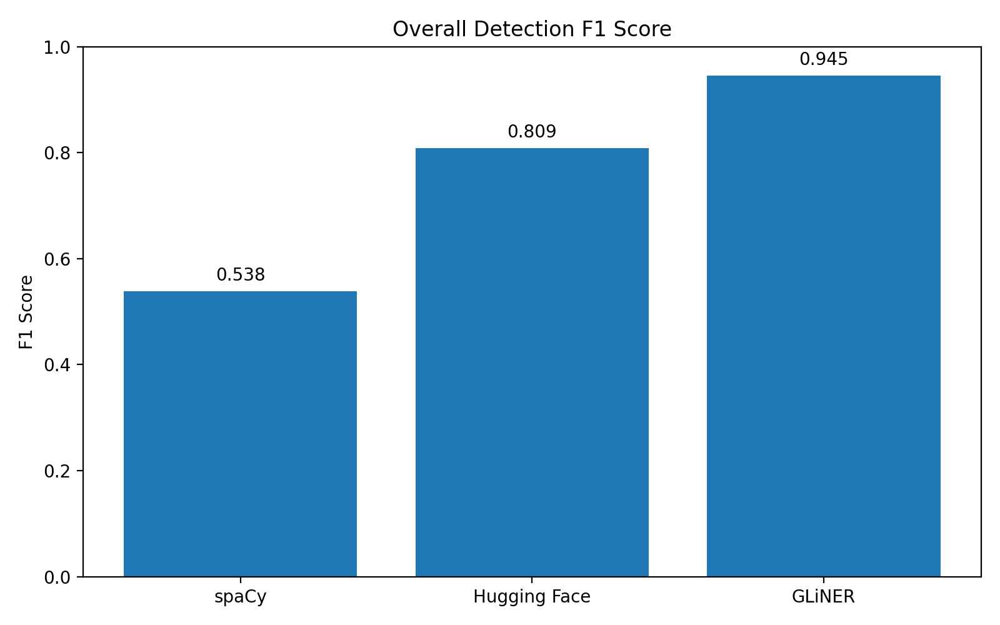
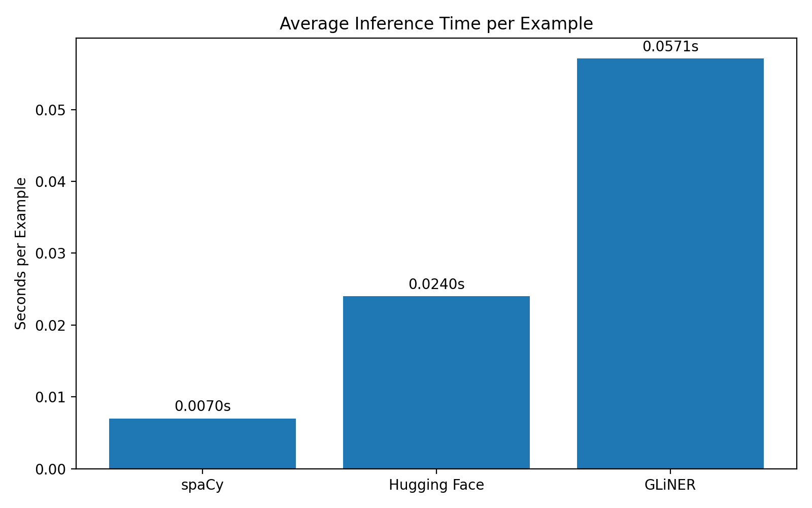
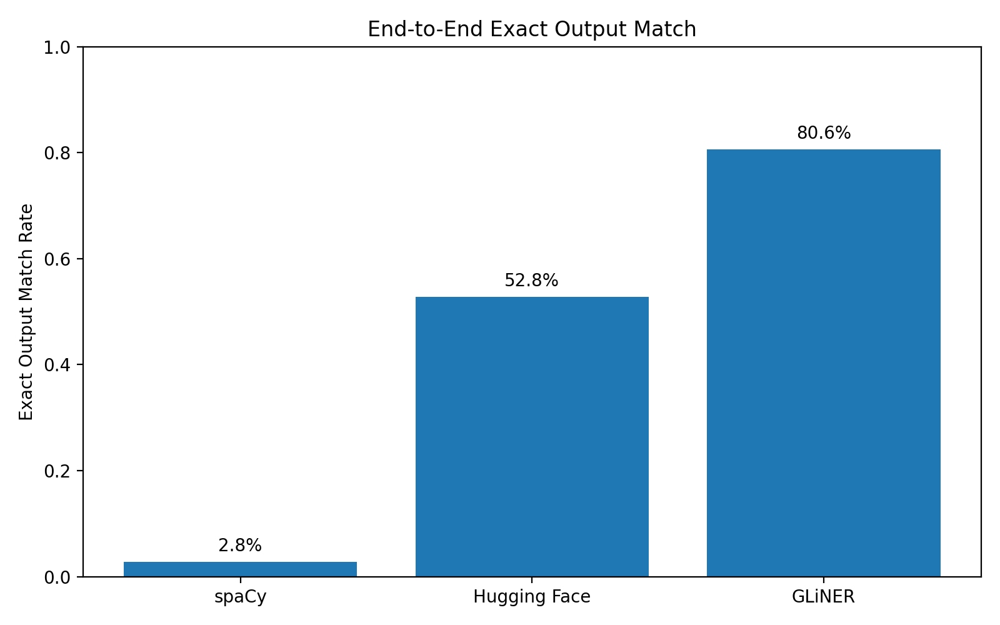

# PII Anonymization Project

A modular Python project for detecting and anonymizing Personally Identifiable Information (PII) in structured and free-text data.

The project implements multiple PII detection approaches and compares their detection quality, computational performance, error characteristics, and end-to-end anonymization results.

---

## Project Overview

The system is divided into four main stages:

```text
Input Data
    ↓
Normalization / Loading
    ↓
PII Detection
    ↓
PII Anonymization
    ↓
Anonymized Output

The project supports:

Structured data anonymization
Free-text PII detection
Multiple NER-based detection approaches
Rule-based PII detection
Pseudonymization
Masking
Redaction
Generalization
Detection evaluation
Error analysis
Performance benchmarking
End-to-end anonymization evaluation
Ground-truth validation
Automated tests

                    ┌─────────────────────┐
                    │      Input Data     │
                    │ CSV / Excel / JSON  │
                    │       / TXT         │
                    └──────────┬──────────┘
                               │
                               ▼
                    ┌─────────────────────┐
                    │ Universal Loader    │
                    └──────────┬──────────┘
                               │
                               ▼
                    ┌─────────────────────┐
                    │      Detection      │
                    ├─────────────────────┤
                    │ Regex               │
                    │ spaCy               │
                    │ Hugging Face NER    │
                    │ GLiNER              │
                    └──────────┬──────────┘
                               │
                               ▼
                    ┌─────────────────────┐
                    │   Anonymization     │
                    ├─────────────────────┤
                    │ Pseudonymization    │
                    │ Masking             │
                    │ Redaction           │
                    │ Generalization      │
                    └──────────┬──────────┘
                               │
                               ▼
                    ┌─────────────────────┐
                    │ Anonymized Output    │
                    └─────────────────────┘


Detection Approaches

Three AI-based NER approaches are implemented:

spaCy
Hugging Face NER
GLiNER

A rule-based regular-expression detector is also used for structured PII fields.

All NER detectors follow a common detector interface.

Structured Data

The current synthetic diabetology dataset contains structured PII fields such as:

Patient Code
First Name
Surname
Tax Code
Birth Date
Assessment Date
Age At Assessment

These structured fields are handled by the regex-based detection and rule-based anonymization pipeline.


Free Text

The NER approaches are evaluated on synthetic free-text examples containing entities such as:

Person
Location
Organization
Date
Miscellaneous entities

The NER detector can be selected through the application interface:
spacy
huggingface
gliner
The current diabetology Excel dataset does not contain a dedicated free-text column, so its structured PII is handled through the structured detection path


Anonymization Methods

Different PII fields use different anonymization policies.

| PII Field         | Method           |
| ----------------- | ---------------- |
| Patient Code      | Pseudonymization |
| First Name        | Masking          |
| Surname           | Masking          |
| Tax Code          | Masking          |
| Birth Date        | Generalization   |
| Assessment Date   | Generalization   |
| Age At Assessment | Generalization   |

Examples

Patient codes are pseudonymized consistently:

Original:
A12345

Anonymized:
PATIENT_0001

Names are masked:

Mario
M****

Tax codes are partially masked:

MRLXXXXXX1234U
MRL***********4U

Dates are generalized to their year:

15/03/1985
1985

Ages are generalized into ranges:

74
70-79


Free-Text Anonymization

Detected entities in free text are replaced according to their entity type.

| Entity Type  | Replacement      |
| ------------ | ---------------- |
| Person       | `[PERSON]`       |
| Organization | `[ORGANIZATION]` |
| Location     | `[LOCATION]`     |
| Date         | `[DATE]`         |
| Misc         | `[MISC]`         |


Detected entities are replaced from right to left so that replacing one entity does not invalidate the character offsets of entities appearing earlier in the text


Evaluation Dataset

The evaluation uses a synthetic ground-truth dataset containing:

Total entities: 97
Valid entities: 97
Invalid entities: 0

All 97 ground-truth entities were validated against their character offsets.

The validation checks include:

Start and end offsets are integers
Offsets are within the text boundaries
Start is smaller than end
The annotated span exactly matches the expected entity value

Therefore:

97/97 ground-truth entities are valid


Detection Evaluation

The detectors are evaluated using:

True Positives (TP)
False Positives (FP)
False Negatives (FN)
Precision
Recall
F1-score

A prediction is considered correct when the predicted entity span and normalized entity type match the corresponding ground-truth entity.

Final Detection Results

| Detector     | Overall Precision | Overall Recall | Overall F1 |
| ------------ | ----------------: | -------------: | ---------: |
| spaCy        |             0.441 |          0.691 |      0.538 |
| Hugging Face |             0.860 |          0.763 |      0.809 |
| **GLiNER**   |         **0.922** |      **0.969** |  **0.945** |
GLiNER currently provides the highest overall detection quality on the evaluation dataset.

Structured Detection Results

| Detector     | Precision |    Recall |        F1 |
| ------------ | --------: | --------: | --------: |
| spaCy        |     0.323 |     0.574 |     0.413 |
| Hugging Face |     0.809 |     0.704 |     0.752 |
| **GLiNER**   | **0.867** | **0.963** | **0.912** |

GLiNER also provides the strongest performance on the structured portion of the evaluation dataset.

Free-Text Detection Results

| Detector     | Precision |    Recall |        F1 |
| ------------ | --------: | --------: | --------: |
| spaCy        |     0.643 |     0.837 |     0.727 |
| Hugging Face |     0.923 |     0.837 |     0.878 |
| **GLiNER**   | **1.000** | **0.977** | **0.988** |

GLiNER achieves the highest free-text detection quality, with an F1-score of 0.988.


Error Analysis

The evaluation includes diagnostic analysis of:

False positives
False negatives
Entity-boundary errors
Entity-type errors

The results show different error characteristics for each detector.

spaCy

spaCy produces substantially more false positives and entity-type/boundary errors.

Its main advantage is computational efficiency rather than detection accuracy.

Hugging Face

Hugging Face provides substantially better precision than spaCy and achieves an intermediate overall F1-score.

Some missed entities remain, particularly date entities and partial entity spans.

GLiNER

GLiNER produces substantially fewer errors than the other approaches.

Its remaining errors are limited compared with spaCy and Hugging Face, resulting in the highest overall F1-score.


Performance Benchmark

The performance benchmark uses
Number of examples: 36

The benchmark measures:

Model loading time
Average inference time per example
Memory after model loading
Memory after inference


### Performance Comparison

#### Overall Detection F1



#### Average Inference Time




Final Performance Results

| Detector     | Loading Time (s) | Inference / Example (s) | Memory After Loading (MB) | Memory After Inference (MB) |
| ------------ | ---------------: | ----------------------: | ------------------------: | --------------------------: |
| spaCy        |           2.5090 |            **0.007005** |                **328.99** |                  **330.28** |
| Hugging Face |           4.9060 |                0.024019 |                    395.88 |                     1044.18 |
| GLiNER       |           4.9215 |                0.057125 |                    418.34 |                     1230.72 |

Performance Interpretation

spaCy is the most computationally efficient approach in the benchmark.

It provides:

Lowest loading time
Lowest inference time
Lowest memory usage

GLiNER provides the highest detection quality but requires substantially more computational resources.

Hugging Face provides an intermediate trade-off between computational cost and detection quality.

Therefore, the results demonstrate a clear trade-off between anonymization quality and computational efficiency.

End-to-End Anonymization Evaluation

The end-to-end benchmark evaluates the final anonymized output produced after passing detector predictions through the text anonymization layer.

The benchmark contains:
Examples: 36
Ground-truth entities: 97

The evaluation reports:

Entity anonymization rate
Remaining PII entities
Exact anonymized output matches


### End-to-End Comparison



Final End-to-End Results

| Detector     | Entity Anonymization Rate | Exact Output Match | Remaining PII |
| ------------ | ------------------------: | -----------------: | ------------: |
| spaCy        |                     69.1% |               2.8% |             0 |
| Hugging Face |                     76.3% |              52.8% |             2 |
| **GLiNER**   |                 **96.9%** |          **80.6%** |         **0** |

GLiNER provides the strongest end-to-end anonymization performance.

It correctly anonymizes 94 of 97 ground-truth entities, with 29 of 36 examples producing an exact match with the expected anonymized output.

The entity-level anonymization rate reflects entity-level detection performance under the current evaluation definition and is therefore not treated as an independent anonymization quality metric.

The exact output match rate is used as the primary end-to-end anonymization quality indicator.

GLiNER achieves:

96.9% entity-level anonymization
80.6% exact output match
0 remaining PII entities


Testing

the project includes tests for both structured and free-text anonymization.

Structured Anonymization Tests
Total tests: 9
Passed: 9
Failed: 0
Tested functionality includes:

First name masking
Surname masking
Patient code pseudonymization
Patient code consistency
Tax code masking
Birth date generalization
Assessment date generalization
Age generalization
Preservation of non-detected values

Free-Text Anonymization Tests
Total tests: 5
Passed: 5
Failed: 0

Tested functionality includes:

Person anonymization
Multiple entity anonymization
Date anonymization
Organization anonymization
Preservation of non-PII text
Final Test Result 
14 / 14 tests passed

Running the Project

The project uses Python 3.11.

Set the Python path in PowerShell:
$env:PYTHONPATH="src"

Run the Anonymization Pipeline

The detector can be selected from the command line.

spaCy : py -3.11 -m main --detector spacy
Hugging Face : py -3.11 -m main --detector huggingface
GLiNER : py -3.11 -m main --detector gliner 
The anonymized dataset is generated at: output/anonymized_dataset.xlsx
The output/ directory is ignored by Git because the generated anonymized dataset is an output artifact rather than source code

Running the Evaluation

Ground-Truth Validation : py -3.11 -m evaluation.validate_ground_truth
Expected result:
Total entities: 97
Valid entities: 97
Invalid entities: 0
Detection Evaluation : py -3.11 -m evaluation.evaluation
Performance Benchmark : py -3.11 -m evaluation.performance
Error Analysis : py -3.11 -m evaluation.error_analysis
End-to-End Evaluation : py -3.11 -m evaluation.end_to_end
Structured Anonymization Tests : py -3.11 -m evaluation.test_anonymization
Free-Text Anonymization Tests : py -3.11 -m evaluation.test_text_anonymizer

src/
│
├── main.py
│
├── normalization/
│   ├── common_format.py
│   ├── csv_loader.py
│   ├── excel_loader.py
│   ├── json_loader.py
│   ├── txt_loader.py
│   └── universal_loader.py
│
├── detection/
│   ├── detector_interface.py
│   ├── detection_engine.py
│   ├── comparison.py
│   ├── regex_detector.py
│   ├── ner_detector.py
│   ├── spacy_detector.py
│   ├── hf_detector.py
│   ├── hf_detector_class.py
│   ├── gliner_detector.py
│   ├── gliner_detector_class.py
│   └── test_detectors.py
│
├── anonymization/
│   ├── rule_based_anonymizer.py
│   └── text_anonymizer.py
│
└── evaluation/
    ├── ground_truth.py
    ├── validate_ground_truth.py
    ├── evaluation.py
    ├── performance.py
    ├── error_analysis.py
    ├── anonymization_error_analysis.py
    ├── end_to_end.py
    ├── test_anonymization.py
    └── test_text_anonymizer.py


## Context-Aware Selection Strategy

The benchmark suggests that detector selection should depend on the operational
requirements of the application rather than using a single detector for every
situation.

| Context | Recommended Approach | Reason |
|---|---|---|
| High anonymization quality | GLiNER | Highest overall F1 and end-to-end exact match |
| Complex free text | GLiNER | Strongest free-text F1 |
| Low-latency / resource-constrained | spaCy | Fastest inference and lowest memory footprint |
| Balanced quality and resources | Hugging Face | Intermediate performance/resource trade-off |
| Highly structured identifiers | Regex + rule-based anonymization | Deterministic and predictable |
| Mixed structured + free text | Regex + GLiNER | Combines deterministic identifier handling with contextual NER |

A practical deployment strategy is therefore to use a hybrid pipeline:

**Structured fields → deterministic rules**

**Free text → context-aware NER**

For applications where quality is more important than latency, GLiNER is
preferred. Where computational resources are constrained and latency is more
important, spaCy provides a lighter alternative.

## Conclusion

The project demonstrates a complete PII anonymization pipeline covering
structured data and free-text entity detection.

The evaluation shows a clear trade-off between detection quality and
computational cost.

**spaCy** provides the lowest computational cost and fastest inference,
making it the most lightweight option.

**Hugging Face NER** provides an intermediate trade-off between computational
cost and detection quality.

**GLiNER** achieves the highest detection quality in the current evaluation,
with:

- Overall F1: **0.945**
- Structured F1: **0.912**
- Free-text F1: **0.988**

GLiNER also achieves the strongest end-to-end anonymization result:

- Entity anonymization rate: **96.9%**
- Exact output match rate: **80.6%**
- Remaining PII entities: **0**

Therefore, **GLiNER is the strongest option when anonymization quality is the
primary objective**, while **spaCy is preferable when computational
efficiency is the primary constraint**.

The current evaluation is based on a synthetic dataset and should therefore
be interpreted as a controlled benchmark rather than a guarantee of
performance on real-world data.